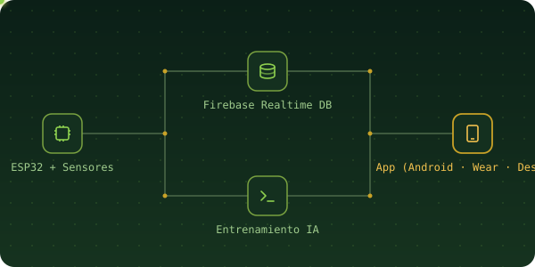
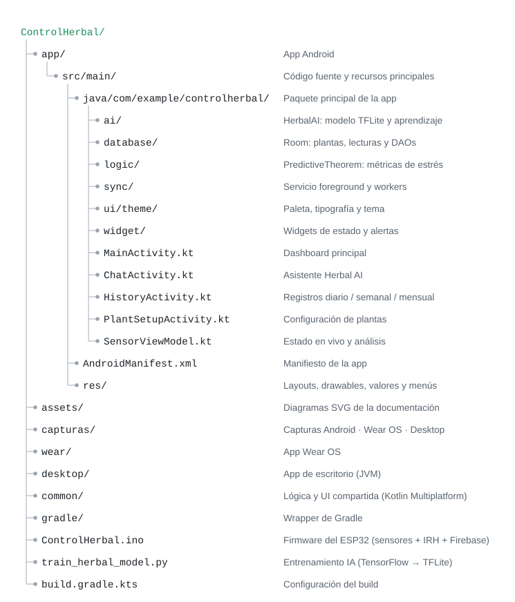
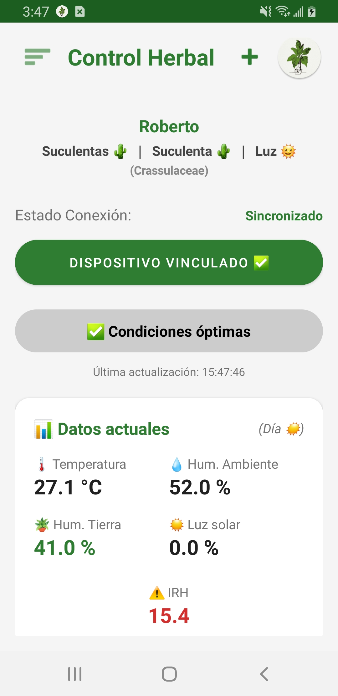
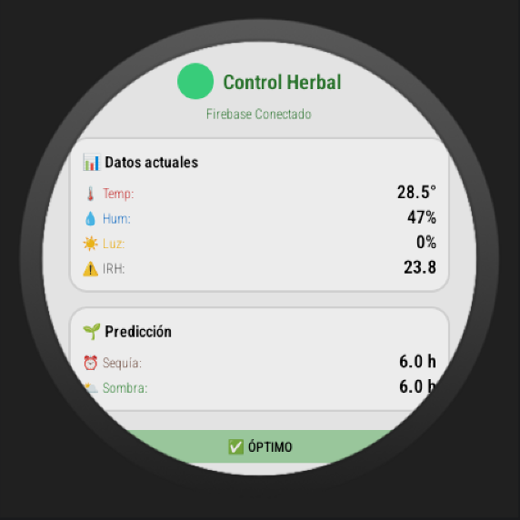
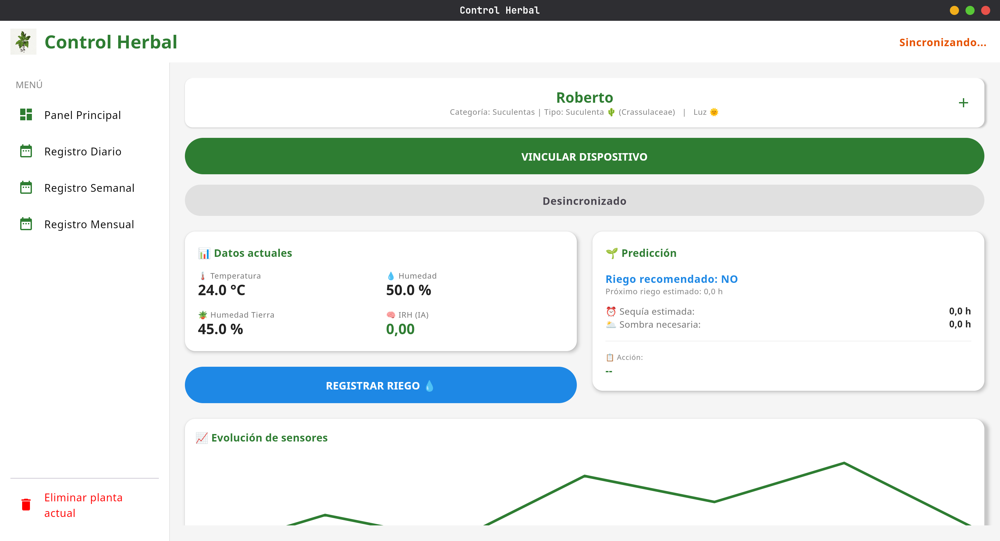

<div align="center">
  

<p>


</p>
</div>

## 🌿 ¿Qué es Control Herbal?

**Control Herbal** es un sistema de monitoreo inteligente para plantas que combina un microcontrolador **ESP32** con sensores ambientales, una base de datos en tiempo real y un modelo de **inteligencia artificial** que aprende de las lecturas reales para predecir el riesgo de estrés de la planta antes de que ocurra.

El objetivo: pasar de "regué la planta cuando me acordé" a un sistema que te avisa **cuántas horas de margen tienes** antes de que la planta entre en sequía o exceso de calor/luz.

> 🚧 **Estado actual:** proyecto de prueba de concepto. El firmware del ESP32 y el pipeline de entrenamiento del modelo ya funcionan; la integración completa en las apps (Android / Wear OS / Desktop) sigue en desarrollo.

---

## Características

- **Lectura en tiempo real** de temperatura, humedad ambiente, luz y humedad de suelo (ciclo de 1s)
- **IRH (Índice de Riesgo Herbal)** — métrica propia que combina el estado actual de cada sensor con su *tendencia* (ej. qué tan rápido se está secando el suelo)
- **Predicción de sequía y necesidad de sombra**, estimando horas de margen antes de que la planta entre en riesgo
-  Perfiles configurables por tipo de planta (luz directa / híbrida / sombra), cada uno con sus propios rangos óptimos
-  Calibración automática del sensor de luz (LDR) con persistencia en memoria
-  Sincronización con **Firebase Realtime Database**
-  Script en **Python + TensorFlow** que entrena un modelo con los datos reales recolectados y lo exporta a **TensorFlow Lite** para correr directo en la app
-  Indicador LED de estado (sensores OK / error de comunicación)

---

## Arquitectura

<div align="center">  </div>

<sub>El ESP32 lee los sensores y sube los datos a Firebase. Desde ahí, el script de Python entrena el modelo de IA (que se exporta como .tflite), mientras que la app multiplataforma consume tanto el estado en vivo de Firebase como el modelo entrenado.</sub>

---

## Estructura del repositorio

<div align="left"> <picture> <source media="(prefers-color-scheme: dark)" srcset="./assets/structure-dark.svg">  </picture> </div>

---

## ¿Cómo se calcula el IRH?

El **Índice de Riesgo Herbal** pondera 4 factores de estrés (humedad ambiente, temperatura, luz y humedad de suelo), cada uno con su propio coeficiente según qué tan crítico es para la salud de la planta. Además, el sistema no solo mira el valor actual de cada sensor, sino su **tendencia** reciente — por ejemplo, si el suelo se está secando muy rápido, el IRH sube antes de que el valor absoluto sea crítico, permitiendo alertar con anticipación.

Con ese IRH y las tendencias, el firmware estima cuántas horas quedan antes de una posible sequía o de que se necesite sombra, y genera una recomendación en texto (riego, sombra, ventilación, etc.).

---

## Tech Stack

<p align="center">
  
</p>
<p align="center">
  
  
</p>

---

## Capturas de pantalla

<p align="center">
  
  
  
</p>

---

## Instalación y uso

### 1. Firmware (ESP32)
1. Instala en Arduino IDE las librerías: `DHT sensor library`, `WiFiMulti`, `FirebaseESP32`, `Preferences`
2. Crea tu propio proyecto en [Firebase](https://console.firebase.google.com/) y habilita Realtime Database
3. **Importante:** no dejes tus credenciales de WiFi ni tu API key de Firebase escritas directamente en el `.ino`. Sepáralas en un archivo `secrets.h` (ejemplo abajo) y agrégalo a tu `.gitignore`
4. Conecta los sensores a los pines definidos (`DHTPIN`, `LDRPIN`, `SOIL_PIN`) y flashea el ESP32

```cpp
// secrets.h (NO subir este archivo a GitHub — agrégalo a .gitignore)
#define WIFI_SSID     "tu_red"
#define WIFI_PASSWORD "tu_password"
#define FIREBASE_HOST "tu-proyecto.firebaseio.com"
#define FIREBASE_API_KEY "tu_api_key"
```

### 2. Entrenamiento del modelo (Python)
```bash
pip install requests pandas numpy tensorflow scikit-learn
python train_herbal_model.py
```
Esto descarga los datos acumulados en Firebase, entrena una red neuronal simple y guarda el modelo listo para la app en `app/src/main/assets/herbal_model.tflite`.

### 3. Apps (Android / Wear OS / Desktop)
Abre el proyecto en **Android Studio** y selecciona el módulo que quieras correr (`app`, `wear` o `desktop`).

---

<div align="center">

Hecho por [**Dominic Escobar**](https://github.com/Dominatricxx) 🌱


</div>
