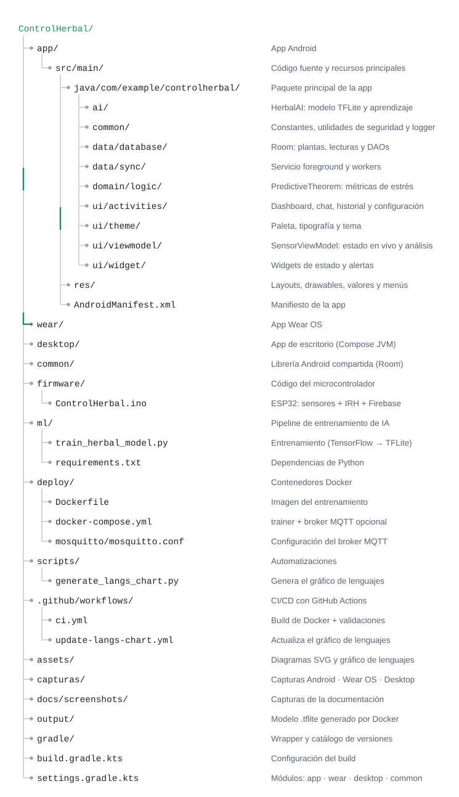
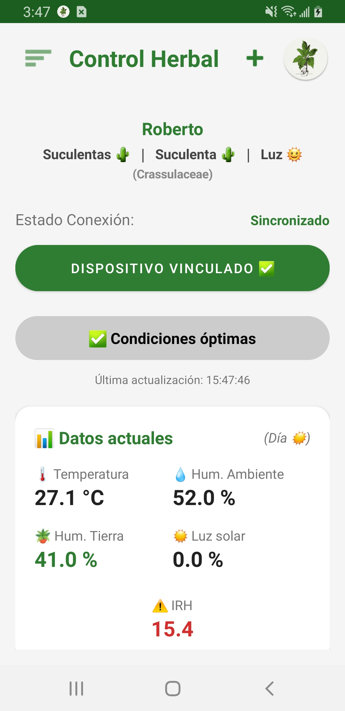
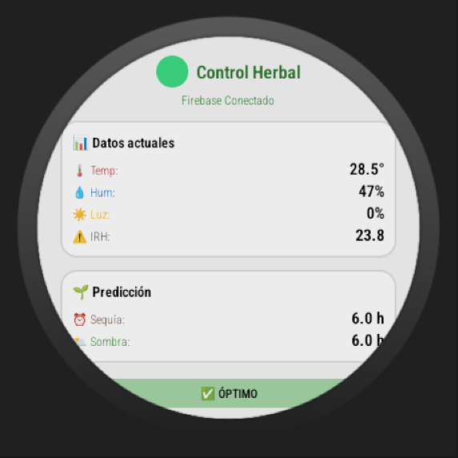
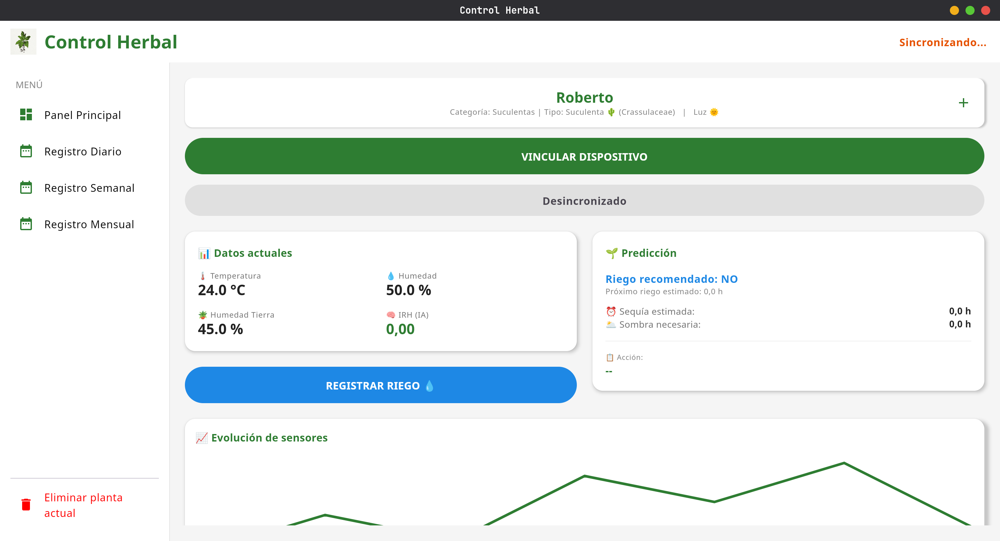
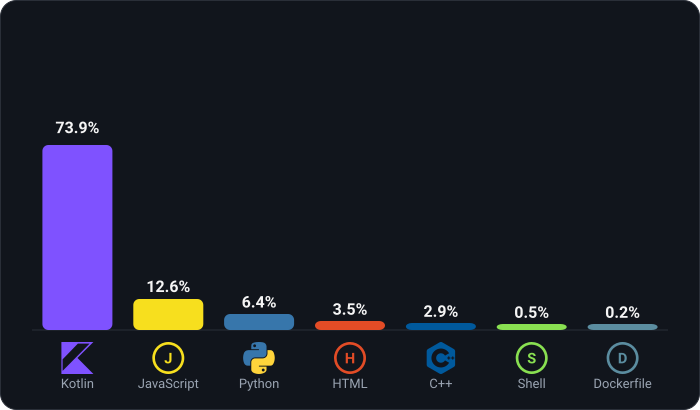

<div align="center">
  

<p>


</p>

</div>

## ¿Qué es Control Herbal?

**Control Herbal** es un sistema de monitoreo inteligente para plantas que combina un microcontrolador **ESP32** con sensores ambientales, una base de datos en tiempo real y un modelo de **inteligencia artificial** que aprende de las lecturas reales para predecir el riesgo de estrés de la planta antes de que ocurra.

Una planta no avisa cuando algo va mal: para cuando las hojas se marchitan, el daño ya está hecho. El proyecto nace de ese problema y del deseo de cuidar mejor lo que crece en casa, reemplazando el "regué cuando me acordé" por información concreta: **cuántas horas de margen tienes** antes de que la planta entre en sequía o sufra exceso de calor o de luz.

Para lograrlo, un ESP32 mide cada segundo la temperatura, la humedad ambiente, la luminosidad y la humedad del suelo, y envía las lecturas a **Firebase Realtime Database**. Con los datos acumulados, un contenedor **Docker** con Python y TensorFlow entrena un modelo que se exporta a **TensorFlow Lite**. Las aplicaciones en Kotlin (Android, Wear OS y escritorio) comparten un módulo común que lee el estado en vivo, aplica el modelo y presenta recomendaciones claras.

El flujo también funciona en sentido contrario: desde la app se elige el tipo de planta, ese dato se guarda en Firebase y el ESP32 lo lee para ajustar los rangos que considera óptimos. Así, cada planta se evalúa con sus propias necesidades y no con un criterio único para todas.

> **Estado actual:** proyecto de prueba de concepto. El firmware del ESP32 y el pipeline de entrenamiento del modelo ya funcionan; Continuamente se realizan mejoras de optimización, seguridad y automatización.

---

## Características

- **Lectura en tiempo real** de temperatura, humedad ambiente, luz y humedad de suelo (ciclo de 1s)
- **IRH (Índice de Riesgo Herbal)** — métrica propia que combina el estado actual de cada sensor con su *tendencia* (ej. qué tan rápido se está secando el suelo)
- **Predicción de sequía y necesidad de sombra**, estimando horas de margen antes de que la planta entre en riesgo
- **Recomendaciones en texto** (riego, sombra, ventilación, etc.) generadas a partir del IRH y de las tendencias
- **Perfiles configurables por tipo de planta** (luz directa / híbrida / sombra), cada uno con sus propios rangos óptimos
- **Configuración bidireccional:** la app escribe el tipo de planta en Firebase (`/config`) y el ESP32 lo lee para adaptarse
- **Calibración automática del sensor de luz (LDR)** con persistencia en memoria
- **Sincronización con Firebase Realtime Database**, con los datos de sensores en `/sensor`
- Script en **Python + TensorFlow** que entrena un modelo con los datos reales recolectados y lo exporta a **TensorFlow Lite** para correr directo en la app
- **Entrenamiento reproducible con Docker**, sin necesidad de instalar TensorFlow en el equipo
- **Apps multiplataforma en Kotlin** (Android, Wear OS y Desktop JVM) que comparten un módulo común
- **Automatización con GitHub Actions:** compilación y validación de la imagen Docker, y actualización automática del gráfico de lenguajes
- **Broker MQTT opcional** (Mosquitto) para extender la comunicación del sistema
- **Indicador LED de estado** (sensores OK / error de comunicación)

---

## Arquitectura

<div align="center">  </div>

<sub>El ESP32 lee los sensores y sube los datos a Firebase. Desde ahí, el script de Python entrena el modelo de IA (que se exporta como .tflite), mientras que la app multiplataforma consume tanto el estado en vivo de Firebase como el modelo entrenado.</sub>

---

## Estructura del repositorio

<div align="left"> <picture> <source media="(prefers-color-scheme: dark)" srcset="./assets/structure-dark.svg">  </picture> </div>

---

## ¿Cómo se calcula el IRH?

El **Índice de Riesgo Herbal** pondera 4 factores de estrés (humedad ambiente, temperatura, luz y humedad de suelo), cada uno con su propio coeficiente según qué tan crítico es para la salud de la planta. Además, el sistema no solo mira el valor actual de cada sensor, sino su **tendencia** reciente — por ejemplo, si el suelo se está secando muy rápido, el IRH sube antes de que el valor absoluto sea crítico, permitiendo alertar con anticipación.

Con ese IRH y las tendencias, el firmware estima cuántas horas quedan antes de una posible sequía o de que se necesite sombra, y genera una recomendación en texto (riego, sombra, ventilación, etc.).

---

## Tech Stack

<p align="center">
  
</p>

---

## Capturas de pantalla

<p align="center">
  
  
  
</p>

---

## Instalación y uso

### 1. Firmware (ESP32)
1. Instala en Arduino IDE las librerías: `DHT sensor library`, `WiFiMulti`, `FirebaseESP32`, `Preferences`
2. Crea tu propio proyecto en [Firebase](https://console.firebase.google.com/) y habilita Realtime Database
3. **Importante:** no dejes tus credenciales de WiFi ni tu API key de Firebase escritas directamente en el `.ino`. Sepáralas en un archivo `secrets.h` (ejemplo abajo) y agrégalo a tu `.gitignore`
4. Conecta los sensores a los pines definidos (`DHTPIN`, `LDRPIN`, `SOIL_PIN`) y flashea el ESP32

```cpp
// secrets.h (NO subir este archivo a GitHub — agrégalo a .gitignore)
#define WIFI_SSID     "tu_red"
#define WIFI_PASSWORD "tu_password"
#define FIREBASE_HOST "tu-proyecto.firebaseio.com"
#define FIREBASE_API_KEY "tu_api_key"
```

### 2. Entrenamiento del modelo (Python)
```bash
pip install requests pandas numpy tensorflow scikit-learn
python train_herbal_model.py
```
Esto descarga los datos acumulados en Firebase, entrena una red neuronal simple y guarda el modelo listo para la app en `app/src/main/assets/herbal_model.tflite`.

#### Con Docker (sin instalar TensorFlow)
```bash
export FIREBASE_URL="https://TU-PROYECTO-default-rtdb.firebaseio.com/sensor.json"
docker compose -f deploy/docker-compose.yml run --rm trainer
# el modelo queda en ./output/herbal_model.tflite -> cópialo a app/src/main/assets/
```

### 3. Apps (Android / Wear OS / Desktop)
Abre el proyecto en **Android Studio** y selecciona el módulo que quieras correr (`app`, `wear` o `desktop`).

---
## Porcentaje de lenguajes aplicados

<div align="center">

</div>

---


<div align="center">

Hecho por [**Dominic Escobar**](https://github.com/Dominatricxx)


</div>
